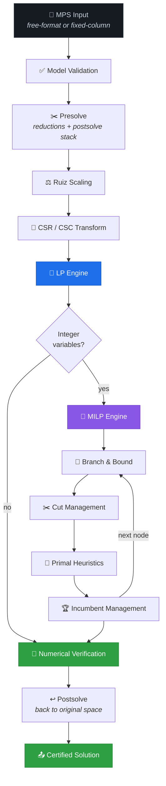
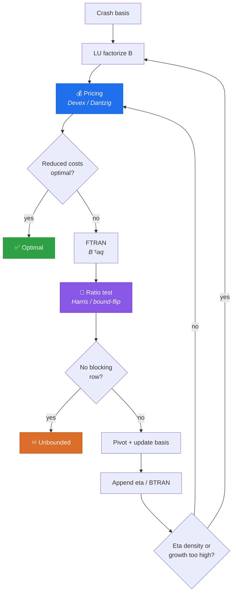
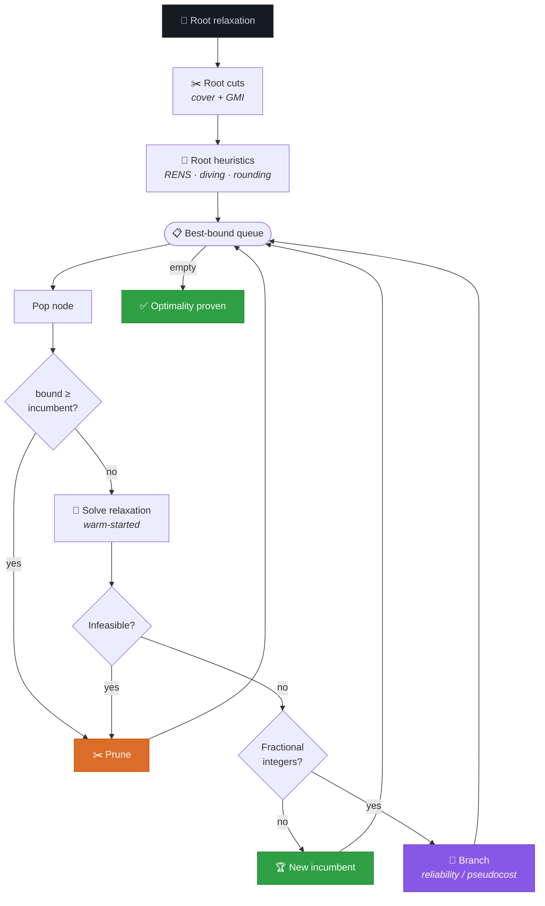
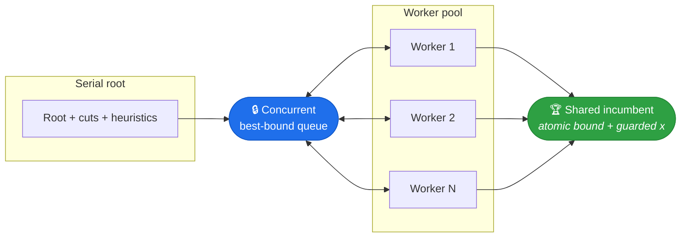
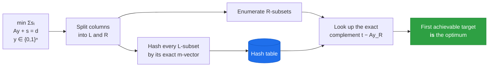
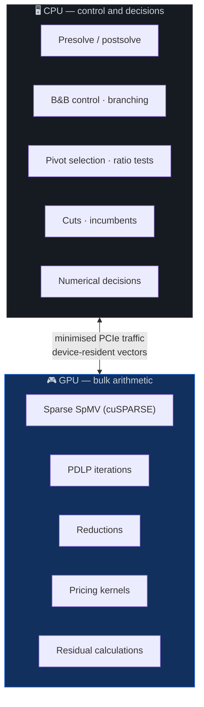
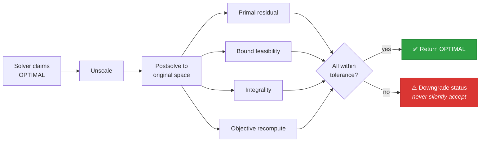

<div align="center">


<br />


<br /><br />


</div>


## Contents

| | |
|---|---|
| [What This Is](#-what-this-is) | [Numerics & Verification](#-numerics--verification) |
| [Design Principles](#-design-principles) | [Measured Results](#-measured-results) |
| [System Architecture](#%EF%B8%8F-system-architecture) | [Building](#%EF%B8%8F-building) |
| [The LP Engine](#-the-lp-engine) | [Running the Benchmarks](#-running-the-benchmarks) |
| [The MILP Engine](#-the-milp-engine) | [Repository Layout](#-repository-layout) |
| [The GPU Layer](#-the-gpu-layer) | [Status & Limitations](#%EF%B8%8F-status--limitations) |


## 🎯 What This Is

**SIHPS** is an optimization engine for **Linear Programming (LP)** and **Mixed-Integer Linear Programming (MILP)**, written in C++17 with CUDA acceleration.

The distinguishing constraint of this project is that **every numerical component is implemented from first principles**. There is no HiGHS, no GLPK, no CBC, no SCIP, no Gurobi under the hood. The only external dependencies permitted anywhere in the pipeline are the CUDA Runtime, cuSPARSE, cuBLAS and cuSOLVER — used strictly as *numerical primitives*, never as solvers — plus the C++ standard library.

That means the simplex method, the LU basis factorization and its update scheme, presolve and postsolve, scaling, branch-and-bound, cut separation, primal heuristics and the first-order PDLP solver are all written here.

<table>
<tr>
<td width="33%" valign="top">

**📐 LP Core**

Sparse revised simplex with both primal and dual algorithms, Devex pricing, LU factorization with eta updates, hyper-sparse BTRAN, and warm-started re-solves.

</td>
<td width="33%" valign="top">

**🌲 MILP Core**

Branch-and-bound with reliability branching, cover and Gomory cuts, diving/RENS/local-improvement heuristics, and multi-threaded tree search.

</td>
<td width="33%" valign="top">

**⚡ GPU Layer**

cuSPARSE SpMV, custom pricing kernels, and a complete PDLP first-order solver that runs entirely device-resident.

</td>
</tr>
</table>

### At a glance

| | |
|---|---|
| **Language** | C++17, CUDA C++17 |
| **Source** | 59 files · ~12,650 lines (`src/`) |
| **Tests** | 18 files · ~4,470 lines · **173 test cases** |
| **Benchmarks** | 19 standalone programs (`benchmarks/`) |
| **Problem formats** | MPS (free-format **and** strict fixed-column) |
| **Parallelism** | OpenMP data-parallel kernels + multi-threaded B&B tree search |


## 🧭 Design Principles

These are enforced throughout the codebase, not aspirations.


**1. Correctness precedes speed.** A result is never reported `OPTIMAL` because an iteration limit or a termination flag was reached. Every accepted solution is independently re-verified in the *original* variable space — after postsolve, after unscaling — against primal feasibility, bound feasibility, integrality, and objective value.

**2. No unsupported claims.** Every performance statement in `docs/` is tagged with one of `IMPLEMENTED`, `MEASURED`, `ESTABLISHED METHOD`, `ENGINEERING DECISION`, `RESEARCH HYPOTHESIS`, or `KNOWN LIMITATION`, and is traceable to a raw output file in `docs/measurements/`.

**3. A new lever ships off by default until it is measured.** Optional techniques (GMI cuts, RENS, GCD tightening, warm-started nodes, parallel search) each default to *off* or to the conservative setting until a benchmark shows a net win. Several are documented as **measured null results** and deliberately left disabled — a negative result is recorded, not buried.

**4. Algorithms before kernels.** Reducing the *amount* of mathematical work outranks making individual arithmetic faster. GPU work is only pursued where profiling identifies an end-to-end bottleneck, and is kept only if it improves end-to-end time at equal correctness.


## 🏗️ System Architecture

The top-level solve is a directed pipeline. Three stages are re-entrant: the **LP engine** runs once per B&B node (thousands of times per solve), **cut management** and **heuristics** run per node or node-batch, and **verification** runs both as a cheap per-solve check and as a full end-of-solve certificate.



### Module ownership

Each module is the sole mutator of the data it owns.

| Module | Path | Responsibility |
|---|---|---|
| **I/O** | `src/io/` | MPS parsing (dual-mode), Netlib reference-value parsing |
| **Sparse** | `src/sparse/` | CSR / CSC matrix structures and transposition |
| **Presolve** | `src/lp/Presolve.*` | Reductions + a reversible postsolve stack |
| **Scaling** | `src/lp/Scaling.*` | Ruiz equilibration |
| **Simplex** | `src/lp/Simplex.*` | Primal & dual revised simplex, pricing, ratio tests |
| **Factorization** | `src/lp/BasisFactorization.*` | Sparse LU, eta updates, refactorization triggers |
| **LP driver** | `src/lp/LpSolver.*` | Method selection, verification gate, original-space mapping |
| **PDLP** | `src/lp/Pdlp.*`, `src/cuda/PdlpKernels.cu` | GPU first-order solver |
| **MILP** | `src/milp/MilpSolver.*` | Branch-and-bound, cuts, heuristics, incumbents |
| **Parallel search** | `src/milp/ParallelSearch.hpp` | Concurrent best-bound queue, worker coordination |
| **Exact split** | `src/milp/ExactBinarySplit.*` | Complete enumeration for a narrow structural class |
| **CUDA** | `src/cuda/` | Device memory, SpMV, pricing kernels, residuals |
| **Memory** | `src/memory/` | Two-tier host arena, device-resident allocations |


## 📐 The LP Engine

### The iteration loop



### Implemented

| Capability | Notes |
|---|---|
| **Primal simplex** | Phase-I/Phase-II, bounded-variable handling, free variables |
| **Dual simplex** | Dual ratio test with tiny-pivot rejection; falls back to primal without a dual-feasible start |
| **Warm starts** | `solve_from_basis`-style re-solve seating a parent basis after bound changes, with verified fallback to a cold solve |
| **Devex pricing** | Reference-framework weights with restart on degradation |
| **Basis factorization** | Sparse LU with eta-file updates; refactorization driven by eta density and numerical growth |
| **Hyper-sparse BTRAN** | Active-pattern detection so a small RHS does not trigger a full-vector scan |
| **Presolve** | Singleton rows → bounds, fixed-column removal, redundant-row detection, doubleton substitution, bound propagation, infeasibility/unboundedness detection |
| **Postsolve** | Every reduction carries a reversible mapping; solutions are returned in original column space |
| **Ruiz scaling** | Iterative row/column equilibration, with unscaling verified against the original data |
| **`LpMethod::HYBRID`** | Structure-aware lead (predictor: row count) that lets the first-order solver take instances the simplex abandons — with the fallback result still passing the same verification gate |

### MPS parsing — both dialects

A detail that matters in practice: several classic Netlib models are **not** free-format. `forplan` and `dfl001` embed blanks *inside* row and column names (`"BR   1 1"` is one 8-character name), and `blend`, `gfrd-pnc` and `sierra` leave the RHS vector-name field blank entirely. Whitespace tokenization silently mangles all five.

The reader therefore parses free-format first and, only if that throws, retries the whole file with **strict fixed-column field extraction** at the standard MPS column boundaries. A genuinely malformed file still surfaces its real error.


## 🌲 The MILP Engine

### Branch-and-bound



### Techniques

| Technique | Default | Notes |
|---|---|---|
| **Reliability branching** | ✅ on | Pseudocosts with limited strong-branching probes until reliable |
| **Pseudocost / most-fractional** | selectable | Alternative branching rules |
| **Best-bound node selection** | ✅ on | Deterministic tie-breaks (depth, then node order) — never pointer addresses |
| **Compact node deltas** | ✅ on | A node stores a single `BoundChange` plus a parent pointer; the matrix is never copied per node |
| **Root cover cuts** | ✅ on | Mixed-row cover separation on knapsack-shaped rows |
| **Root GMI cuts** | ⬜ off | Gomory mixed-integer cuts from the final tableau |
| **Integer bound rounding** | ✅ on | MIP presolve rounding integer bounds inward — *measured win* (`neos859080`: 331 → 95 nodes) |
| **GCD row tightening** | ⬜ off | Tightens rows to reachable coefficient-GCD multiples — *measured mixed* |
| **Rounding / diving / local improvement** | ✅ on | Deterministic primal heuristics; they only propose incumbents, never affect pruning |
| **RENS** | ⬜ off | Root sub-MIP heuristic — *measured null* on this benchmark, left off honestly |
| **Warm-started nodes** | ⬜ off | Child seats the parent basis; falls back to cold solve on verification failure |
| **Parallel tree search** | 1 worker | Shared best-bound queue with a fixed worker pool |

### Parallel branch-and-bound

The root is always processed serially (its cuts and heuristics are root-only). Every node after that is pulled from **one shared best-bound queue**, which preserves global node ordering rather than letting each thread drift onto its own frontier.



Two details worth calling out:

- The incumbent is deliberately **split**: the objective is a lock-free atomic (read at every prune check — the hottest read in the search), while the solution vector is mutex-guarded. A pure CAS on the objective alone would let a reader observe a new bound paired with a stale vector.
- Node exploration **order and count become nondeterministic** above one worker. This is a stated trade-off, not a defect: the final status, objective, and feasibility do not depend on processing order — only timing does.

Each node solves its relaxation with LP-level parallelism forced to `SERIAL`, so the two layers never oversubscribe each other.

### Exact binary split — a narrow, complete method

Some models defeat LP-based branch-and-bound *by construction*. In a **market-split** instance (Cornuéjols & Dawande, 1998) the relaxation attains slack 0 fractionally on every instance, so the dual bound sits at exactly `0.00000000` and never moves — no amount of branching or low-rank cutting changes that.

`ExactBinarySplit` handles this one structural class by **complete enumeration** rather than search:



Because `A ≥ 0`, partial sums are monotone, so *"exceeds d"* prunes soundly on both halves. Targets are enumerated by increasing objective, so the first achievable one **is** the proven optimum — every smaller value has been exhausted first. A "no solution" answer is therefore a **proof**, and the reconstructed assignment is re-verified against the original coefficients before it is returned.

> It is gated on **structure, never on an instance name**, is **off by default**, and is exponential in *n/2* — a specialised complete method, making no claim to be a general MILP technique.


## ⚡ The GPU Layer

The division of labour is explicit and deliberately conservative: **control flow stays on the CPU.**



B&B control flow and pivot decisions are **not** moved to the GPU merely because it is possible — a kernel can be faster in isolation while the whole algorithm gets slower, because the host must synchronise to choose the entering variable.

### PDLP — first-order solving

A complete restarted primal-dual hybrid gradient solver living device-resident: diagonal preconditioning, adaptive step sizes, adaptive restarts, fused vector-update kernels, and a deliberately minimised synchronisation count.

Its role is honest and bounded: it is used for **large standalone LPs** where the simplex stalls, not as a replacement for warm-started dual simplex inside branch-and-bound. Convergence is not treated as verification — a first-order point still has to pass the same original-space gate as any other result.


## 🔬 Numerics & Verification



**The hard invariant:** a status is a claim about the *original* model. Anything that cannot be re-verified there is downgraded rather than reported.

Supporting infrastructure:

- **Independent checkers** for primal feasibility, bound feasibility, integrality and objective value.
- **Differential testing** — presolve on/off and scaling on/off must agree on real Netlib models. A reduction that is subtly wrong shows up here as a differing optimum, which no amount of synthetic unit testing would catch.
- **Cross-method validation** — simplex vs. first-order objectives compared for disagreement.
- **Compute Sanitizer** — `memcheck` and `racecheck` logs for the CUDA paths are checked in under `docs/measurements/compute-sanitizer/`.
- **Determinism** — identical input and configuration produce identical results at a fixed worker count.


## 📊 Measured Results

> Every number below is traceable to a raw output file in `docs/measurements/`. Measurements are taken in a **single process with nothing else running** — this repository's own history records a case where concurrent benchmark processes produced a reported "39× GPU speedup" that clean re-measurement showed to be a **tie**, because oversubscription hits size-gated parallel paths far harder than serial ones.

### Linear programming — Netlib

| KPI | Value |
|---|---|
| Validated instances solved (`HYBRID`) | **93 / 93** |
| — simplex alone | 92 / 93 |
| Kennington + QAP cross-method | **21 / 21**, 0 objective disagreements |
| Total models solved | **114 / 114** |
| Geometric mean time | 0.030 s |
| Median time | 0.020 s |
| 95th percentile | 4.033 s |
| Worst relative objective error | 5.78e-07 |
| Row cap | 20,000 |

### Mixed-integer programming — MIPLIB 2017 subset

Certified results on the 5-instance small set. `EXACT` means the status is a **proven** optimum (or proven infeasibility), not merely an incumbent that happens to match.

| Instance | Result | Objective | Reference | Verdict |
|---|---|---|---|---|
| `neos859080` | Infeasibility **proven** | — | infeasible | ✅ `EXACT` |
| `pk1` | Optimality **proven** | 11 | 11 | ✅ `EXACT` |
| `gen-ip002` | Optimality **proven** | −4783.7334 | −4783.733392 | ✅ `EXACT` |
| `markshare2` | Optimality **proven** | 1 | 1 | ✅ `EXACT` |
| `gen-ip054` | Incumbent matches optimum; gap not closed | 6840.96564179 | 6840.96564179 | ⏳ `TIME_LIMIT` |

`markshare2` is the notable one: its dual bound is pinned at exactly `0.00000000` across 8.68M branch-and-bound nodes, so ordinary search can never close it. It is certified here by complete enumeration — 5.49 billion subsets examined, **zero LP solves**, with the returned assignment independently re-verified.

`gen-ip054` is a compute-budget limitation rather than a structural wall: its bound has moved 6819.83 → 6834.16 (gap 0.309% → 0.0995%) as the budget grows.

### A broader honesty check

On a broadened 24-instance structurally diverse MIPLIB subset: **0 wrong answers**. All infeasible-tagged instances are correctly detected, and every remaining non-exact result is an honest `TIME_LIMIT` or a documented tolerance trade-off.


## 🛠️ Building

### Requirements

| | |
|---|---|
| **CMake** | ≥ 3.24 |
| **Compiler** | C++17 (tested with GCC 15.2) |
| **CUDA Toolkit** | Required — provides cuSPARSE / cuBLAS |
| **OpenMP** | Optional — every parallel loop is written so that dropping the pragmas changes nothing but the wall clock |

### Build

```bash
cmake -S . -B build -DCMAKE_BUILD_TYPE=Release
cmake --build build -j"$(nproc)"
```

The CUDA architecture defaults to `89`. Override for a different device:

```bash
cmake -S . -B build -DCMAKE_CUDA_ARCHITECTURES=86
```

Options: `-DSIHPS_BUILD_TESTS=OFF`, `-DSIHPS_BUILD_BENCHMARKS=OFF`.

> The build stamps the resolved **git commit and dirty state** into every benchmark record — a benchmark result that cannot name the commit that produced it is not reproducible.

### Test

```bash
cd build && ctest --output-on-failure
```


## 🚀 Running the Benchmarks

> Netlib LP models are **not** redistributed here. Fetch them into `data/netlib_lp/feasible/` (for example from the COIN-OR `Data-Netlib` mirror) before running the LP sweeps.

**Validate LP correctness against published optima:**

```bash
./build/benchmarks/validate_netlib data/netlib_lp/feasible data/netlib_readme.txt 20000
```

Expected values are *not* hardcoded — they are parsed at runtime from Netlib's own index file, and an instance passes only if the objective matches a published value. An optional trailing path writes **JSON Lines** records carrying full reproducibility metadata (commit, compiler, CUDA version, GPU, driver, CPU, RAM, thread count, solver configuration, and an FNV-1a 64 content hash per instance).

**MIPLIB subset:**

```bash
./build/benchmarks/bench_miplib data/miplib2017_small data/miplib2017_small/miplib2017-v36.solu
```

Positional arguments enable the optional techniques, so a plain invocation always reproduces the shipped-default baseline:

```
bench_miplib <dir> <solu> <instance|""> <secs> <branching> \
             <warm> <gmi> <int_round> <rens> <workers> <gcd> <basis_cap> <exact_split>
```

**Other programs** in `benchmarks/`: `validate_crossmethod`, `validate_infeasible`, `bench_lp_solve`, `bench_lp_algorithm`, `bench_pdlp`, `bench_spmv`, `bench_spmv_algorithm`, `bench_pricing_rule`, `bench_pricing_backend`, `bench_parallel`, `bench_gpu_latency`, `profile_simplex`, `debug_one`.


## 📁 Repository Layout

```text
├── src/
│   ├── io/          MPS reader (free-format + fixed-column), Netlib references
│   ├── sparse/      CSR / CSC matrices, transposition
│   ├── lp/          Presolve, scaling, simplex, factorization, PDLP, LP driver
│   ├── milp/        Branch-and-bound, parallel search, exact binary split
│   ├── cuda/        Device memory, SpMV, pricing kernels, PDLP kernels
│   ├── parallel/    OpenMP wrappers (no-op without OpenMP)
│   ├── memory/      Two-tier host arena, device allocations
│   └── bench/       Run metadata and resource snapshots
├── benchmarks/      19 standalone benchmark / validation programs
├── tests/           173 unit tests
├── docs/
│   ├── architecture/  SYSTEM · LP · MILP · NUMERICS · CPU_GPU · MEMORY · PDLP
│   ├── measurements/  Raw, unedited benchmark output — the evidence base
│   ├── research/      SOTA survey, gap analysis
│   └── ROADMAP_STATUS.md
├── reports/         Generated comparison reports
└── data/            MIPLIB subset + Netlib index (LP models fetched separately)
```


## ⚠️ Status & Limitations

Stated plainly, in the spirit of the project's own rules.

| Area | Status |
|---|---|
| **LP** | Mature. Validated against published Netlib optima with independent verification. |
| **MILP** | Working branch-and-bound with cuts, heuristics and parallel search. Node throughput and cut variety are well behind mature commercial solvers. |
| **QP** | ❌ Not implemented. Deliberately deferred until LP/MILP correctness is stable. |
| **`dfl001`** | Known iteration-limit case for the simplex path — reported honestly as `ITERATION_LIMIT`, never as a false optimum. |
| **GPU pricing** | Implemented and measured; retained only where it improves end-to-end time. |
| **Cut families** | Cover and GMI only. Flow-cover, clique, implied-bound and knapsack-cover cuts are not implemented. |
| **Symmetry handling** | Not implemented. |

### Documentation

| Document | Contents |
|---|---|
| [`docs/architecture/SYSTEM.md`](docs/architecture/SYSTEM.md) | Module ownership and interfaces |
| [`docs/architecture/LP.md`](docs/architecture/LP.md) | Algorithm selection, degeneracy, factorization |
| [`docs/architecture/MILP.md`](docs/architecture/MILP.md) | B&B, cuts, heuristics, parallel search |
| [`docs/architecture/NUMERICS.md`](docs/architecture/NUMERICS.md) | Precision policy, tolerances, the hard invariant |
| [`docs/architecture/CPU_GPU.md`](docs/architecture/CPU_GPU.md) | Responsibility matrix, PCIe policy |
| [`docs/architecture/PDLP.md`](docs/architecture/PDLP.md) | First-order design and measured limits |
| [`docs/ROADMAP_STATUS.md`](docs/ROADMAP_STATUS.md) | Status against the engineering roadmap |
| [`docs/measurements/`](docs/measurements/) | Raw benchmark output — the evidence base |

<div align="center">


### The governing rule

> **No optimization is accepted unless it improves a declared benchmark KPI<br/>without reducing correctness or solvability.**

<br />

<sub>Built from first principles — no external LP/MILP solver, wrapper, or optimization library at any stage.</sub>


</div>
